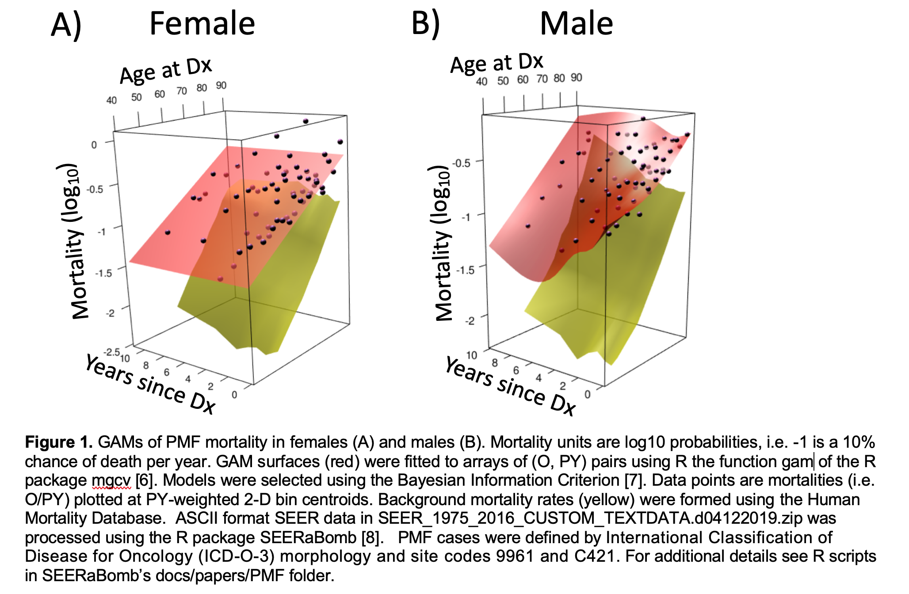
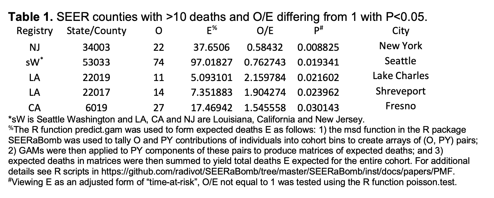

# Generalized Additive Model Visualization of Primary Myelofibrosis Mortality 
In data-rich scenarios of analyzing Surveillance, Epidemiology, and End Results (SEER) data [1], Cox models [2] of individual survival times can be replaced by generalized additive models (GAM) [3] of aggregate numbers of deaths and person years (PY) in intervals. An advantage of this is mortality visualization. This is illustrated here for primary myelofibrosis (PMF) [4]. 

In 4442 SEER PMF cases diagnosed in 1/1/2001 to 12/31/2016, 2713 deaths were observed (O) by 12/31/2016. These deaths were partitioned into male and female 8 x 8 arrays of (O, PY) pairs using 12.5 percentile cut-points on time since diagnosis t and age at diagnosis a. Sex (s) specific GAMs were then fitted to these arrays. The GAMs are visualized as mortality (probability of death per PY) surfaces over t and a (Figure 1). It is interesting that gaps between PMF and background mortalities (computed using data in the Human Mortality Database) close with age at diagnosis and times since diagnosis specifically in males.  Lack of time since diagnosis dependence in females but not males is also interesting. GAMs are useful in that they enable these mortality visualizations.

GAMs of PMF mortality in females (A) and males (B). Mortality units are log10 probabilities, i.e. -1 is a 10% chance of death per year. GAM surfaces (red) were fitted to arrays of (O, PY) pairs using R the function gam of the R package mgcv [6]. Models were selected using the Bayesian Information Criterion [7]. Data points are mortalities (i.e. O/PY) plotted at PY-weighted 2-D bin centroids. Background mortality rates (yellow) were formed using the Human Mortality Database.  ASCII format SEER data in SEER_1975_2016_CUSTOM_TEXTDATA.d04122019.zip was processed using the R package SEERaBomb [8].   PMF cases were defined by International Classification of Disease for Oncology (ICD-O-3) morphology and site codes 9961 and C421. For additional details see R scripts in SEERaBomb’s docs/papers/PMF folder.

The GAMs in Figure 1 can also be used to estimate expected numbers of deaths in a PMF cohort had members instead been typical/average US PMF patients with the same s, t, and a aggregate PY distribution. Applying then to individual SEER registry PMF cohorts, mortality was highest in Louisiana with 149 PMF deaths observed (O) and 112.6 expected (E) (P=0.001, Poisson test). No other registry’s O/E ratio differed significantly from 1, i.e. was below or above average.  

Division of O by PY yields raw mortalities (data points in Figure 1), division of E by PY yields mortalities smoothened by neighboring mortality values (surfaces in Figure 1), and division of total O by total E normalizes total O not only for cohort differences in sizes and follow-up (as division by total PY does) but also PY differences in s, t, and a. Viewing total E as an adjusted form of Poisson process time (as doubling it roughly doubles events) yields P values for O/E differing from 1, e.g. P = 0.001 above for 149/112.6. 

Cancer mortality is high in Arkansas, Mississippi and Louisiana [5]. Of these states, only Louisiana is a SEER registry. This may explain why Louisiana stood out. Applying the same GAMs in Figure 1 to SEER counties, Lake Charles and Shreveport were among five with more than 10 deaths and P < 0.05 (Table 1). This table also shows high PMF mortality in Fresno, but this may be due to chance, as cancer mortality is not high in this area [5] and corrections for multiple testing were not made.  Low PMF mortalities in Seattle and New York City in Table 1 are consistent with low cancer mortalities in these regions [5]. These consistencies lend credence to the surfaces in Figure 1. 

GAM surface visualization is limited to two dimensions. To visualize additional dimensions, such as calendar years, a variable must be left out of surfaces and instead displayed as a panel variable. The number of panels then increases by a factor of n for n bins in the variable left out. This is a limitation to the extent that it can become unwieldly. 

If some counties offer better PMF care than others, patients may wish to relocate. Using Table 1 in such decision making requires US population geographical homogeneity with respect to factors (e.g. genetics) that may influence cancer aggressiveness. If this is reasonable, applying the approach proposed here to other cancers to generate O/E values as in Table 1 could impact cancer patient relocation decisions more broadly.  

In Cox SEER analyses, significance often arises in many parameters (e.g. in high-order polynomials in age).  In such data-rich scenarios, foregoing power by pooling deaths in bins may be worth the visualization and conceptual clarity gained in GAM analyses.    

### References

[1] SEER. Surveillance, Epidemiology, and End Results (SEER) Program Research Data (1975-2016), National Cancer Institute, DCCPS, Surveillance Research Program, Surveillance Systems Branch (www.seer.cancer.gov), released April 2019, based on the November 2018 submission. Treatment data is available from https://seer.cancer.gov/data/treatment.html. 2019.

[2] Cox DR. Regression models and life tables. Journal of the Royal Statistical Society, SerB. 1972;34:187-220.

[3] Hastie T, Tibshirani R. Generalized additive models for medical research. Statistical methods in medical research. 1995;4:187-96.

[4] Savona MR. Are we altering the natural history of primary myelofibrosis? Leukemia research. 2014;38:1004-12.

[5] Dwyer-Lindgren L, Bertozzi-Villa A, Stubbs RW, Morozoff C, Kutz MJ, Huynh C, et al. US County-Level Trends in Mortality Rates for Major Causes of Death, 1980-2014. JAMA. 2016;316:2385-401.

[6] Wood SN. Generalized Additive Models: An Introduction with R. Boca Raton: Chapman & Hall CRC; 2017.

[7] Schwarz GE. Estimating the dimension of a model. Annals of Statistics. 1978;6:461-4.

[8] Radivoyevitch T, Sachs RK, Gale RP, Molenaar RJ, Brenner DJ, Hill BT, et al. Defining AML and MDS second cancer risk dynamics after diagnoses of first cancers treated or not with radiation. Leukemia. 2016;30:285-94.

