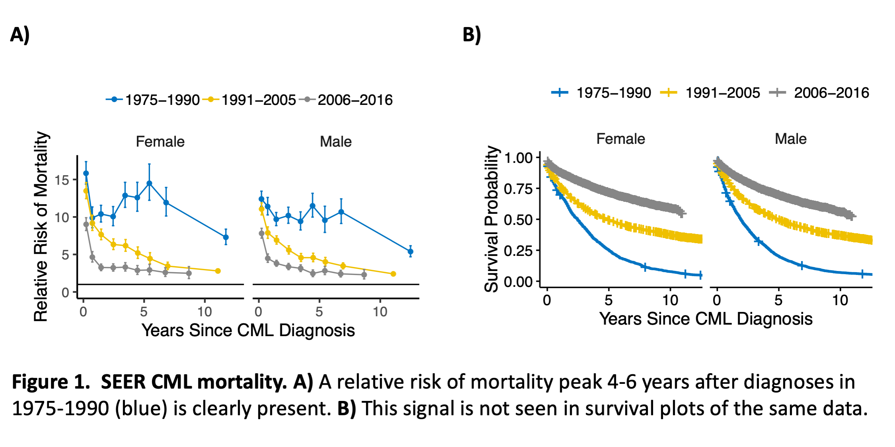
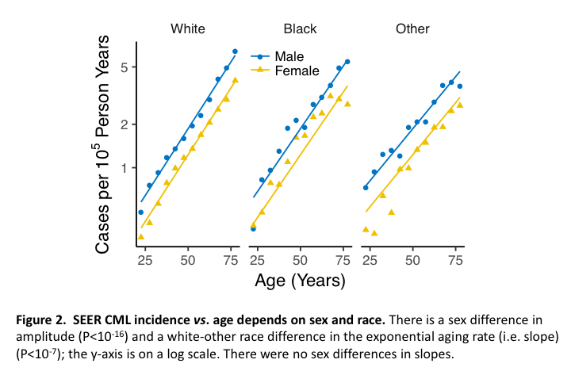
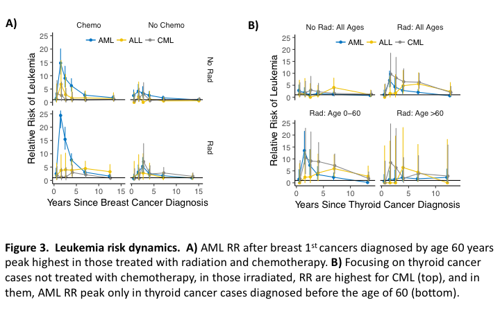
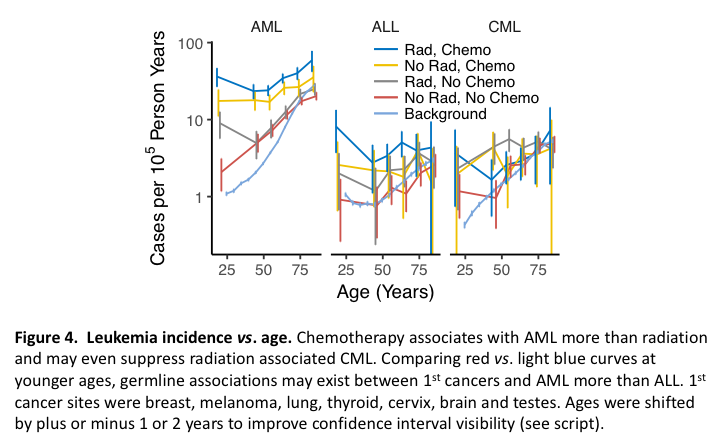
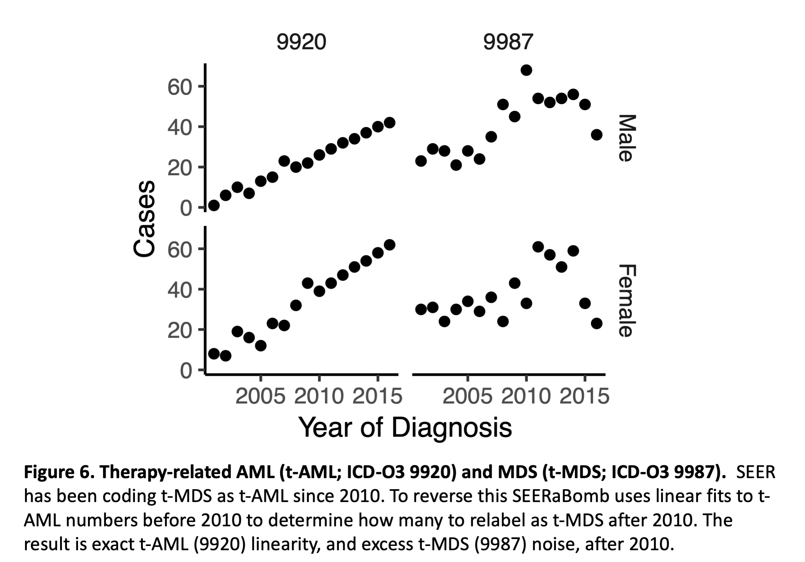

# SEERaBomb
SEERaBomb facilitates SEER and A-bomb data analyses in R.  To install it use:  
```
devtools::install_github("radivot/SEERaBomb",subdir="SEERaBomb")
```

## Surveillance, Epidemiology, and End Results (SEER) Data
**WARNING:** SEERaBomb does not work with SEER data that does not contain treatment information, 
i.e. you must obtain this extended dataset 
https://seer.cancer.gov/data/treatment.html
by signing an additional SEER data use agreement. For now, please continue to use 1975-2016 ASCII data, as 
the new 1975-2017 dataset is not yet available in this much needed format. 

To set up SEER data use in R, unzip the custom radiation and chemotherapy ASCII text 
version of the SEER data into ~/data/SEER where ~ is your home directory. 
On a Mac ~ is /Users/username, on linux it is /home/username, 
and in Windows ~ is /Users/username/Documents. 

**CAUTION:** It is best to use ~/data as the root location of all data used by SEERaBomb.  

SEER ASCII data in ~/data/SEER/incidence and ~/data/SEER/populations is then converted into an R binary file as follows<br>
```
library(SEERaBomb)  #loads installed package SEERaBomb into memory 
(df=getFields())    #gets SEER fields into a data frame
(rdf=pickFields(df))#picks a subset of SEER fields and defines their types
mkSEER(rdf)         #makes merged data file ~/data/SEER/mrgd/cancDef.Rdata
```

Check the SEER data installation using 
```
load("~/data/SEER/mrgd/cancDef.RData")#loads data.frame canc into memory 
head(canc,3)                          #returns top 3 rows of canc
``` 


##  A-Bomb Survivor Data
To use the Japanese atomic bomb survivor data, obtain the files lsshempy.csv and lssinc07.csv from https://www.rerf.or.jp/en/library/data-en/
under  “The incidence of leukemia, lymphoma and multiple myeloma among atomic bomb survivors: 1950-2001” and 
“Solid Cancer Incidence Data, 1958-1998”,  place them in ~/data/abomb, and run  
```
mkAbomb() #converts files in ~/data/abomb into ~/data/abomb/abomb.RData
```

As a check,
```
load("~/data/abomb/abomb.RData")#loads data frames heme and solid 
View(heme)                      #note descriptions under column names
```
should show the hematological A-bomb data in a tab named heme in RStudio’s upper left panel.

## Human Mortality Database (HMD) Data
To generate relative risk of mortality plots go the human mortality database  https://www.mortality.org/ and register. Then go to the bottom of  https://www.mortality.org/cgi-bin/hmd/hmd_download.php
and download "All HMD countries" and unzip it into ~/data/hmd_countries.  Now run <br>
```
mkMrtLocal() #converts files in ~/data/hmd_countries/USA into ~/data/mrt/mrtUSA.RData
``` 

To check the installation run 
```
load("~/data/mrt/mrtUSA.RData")  #loads R binary created by mkMrtLocal() 
head(mrt$Female)   #shows first 5 years of female mortality rates 1933-2015
```

##  Usage
The code chunk below must be run before the examples. It loads libraries and data and defines acronyms.
```
graphics.off();rm(list=ls())#clear plots and environment
library(tidyverse);library(SEERaBomb);library(ggsci)#load packages          
library(survival);library(survminer);library(bbmle)
load("~/data/SEER/mrgd/cancDef.RData")#load SEER cancer data
load("~/data/SEER/mrgd/popsae.RData")#load SEER population data
load("~/data/abomb/abomb.RData")#load A-bomb data
load("~/data/mrt/mrtUSA.RData")#loads US mortality data
canc$cancer=fct_collapse(canc$cancer,AML=c("AML","AMLti","APL"))
secs=c("AML","ALL","CML")#second cancers of interest
gp=geom_point();gl=geom_line()
geRR=geom_errorbar(aes(ymin=rrL,ymax=rrU),width=.2)
ge=geom_errorbar(aes(ymin=LL,ymax=UL),width=0.2)#for absolute risks
gh=geom_hline(yintercept=1)
svts=scale_x_continuous(breaks=c(0,5,10))#surv times
agts=scale_x_continuous(breaks=c(25,50,75))#age times
sbb=theme(strip.background=element_blank())
ltb=theme(legend.margin=margin(0,0,0,0),legend.title=element_blank())
ltp=theme(legend.position="top")
lh=theme(legend.direction="horizontal")
sy=scale_y_log10()
jco=scale_color_jco()
tc=function(sz) theme_classic(base_size=sz);
gxi=xlab("Age (Years)")
gyi=ylab(quote(paste("Cases per ",10^5," Person Years")))
```


### Example 1: CML mortality analyses



Chronic Myeloid Leukemia (CML) mortality RR time courses peak 4-6 years after diagnoses prior to 1990 (Figure 1A). This peak is not discernible in survival plots of the same data (Figure 1B). The R script for Figure 1A is: 
```
d=canc%>%filter(cancer=="CML")%>%print(n=13)
d%>%summarize(n=n(),na=sum(is.na(surv)),prct=100*na/n)#<2% missing
d=d%>%mutate(status=as.numeric(COD>0),surv=(surv+0.5)/12)
d=d%>%select(yrdx,agedx,sex,surv,status)%>%print(n=13)
(D=msd(d,mrt,brkst=c(0,0.5,1,2,3,4,5,6,8),brksy=c(1975,1990,2005,2016)))
gx=xlab("Years Since CML Diagnosis")
gy=ylab("Relative Risk of Mortality")
myt=theme(legend.text=element_text(size=12),strip.text=element_text(size=12))
D%>%ggplot(aes(x=t,y=RR,col=Years))+facet_grid(.~sex)+gp+gl+gx+gy+gh+
       svts+jco+tc(14)+ltb+ltp+sbb+ylim(c(0,NA))+geRR+myt
ggsave("~/Results/tutorial/msdEx1A.pdf",width=4.5,height=3)
```

In the 1st line, %>% pipes the object to the left of it into the first argument of the function to the right of it.  Thus, canc is the first argument of filter(), and the argument shown determines which rows of canc to keep.  The filtered object is then piped to print() to show 13 lines. The 1st 10 have missing survivals. The 2nd line counts cases missing survival times to show that <2% are missing; the number of rows is returned by n(), is.na(surv) returns TRUE where surv is missing (NA), else FALSE, and sum() converts TRUE to 1 and FALSE to 0 before summing over the elements of its input vector. In the 3rd line mutate() creates `d$status` and overwrites `d$surv` to be in years, not months. For status, a non-zero cause of death (COD) code implies a death event, COD>0 converts a vector of integers into a vector of logicals, and as.numeric() converts FALSE to 0 and TRUE to 1. For surv, 0.5 is added to survival times in months because they were rounded down by SEER. The 4th line selects columns of interest. The 5th line calls SEERaBomb’s mortality-since-diagnosis function msd() with data frame d, which must include age, sex and year to match background mortality rates in mrt. Other msd() arguments are breakpoints of times-since-diagnosis (brkst) in years and year-of-diagnosis (brksy). The msd() output D has columns t (PY-weighted means of time intervals since diagnosis), RR, and Years (year-of-diagnosis interval); Years is a factor, i.e. a vector of integers where different integers are associated with different strings. D is then plotted to create Figure 1A.  In this call, facet_grid() accepts an argument of class formula, read as y~x, so .~sex indicates that in the plot layout, sex is in the x direction. Finally, in the last line, ggsave() saves the plot to a file; the type of file is inferred from the filename suffix. 

Figure 1B is then produced by this additional code:
```
labs=c("1975-1990","1991-2005","2006-2016")
d=d%>%mutate(yrg=cut(yrdx,c(1974,1990,2005,2016),labels=labs))%>%print(n=13)
fit=survfit(Surv(surv,status)~yrg+sex,data=d) 
gy=ylab("Survival Probability")
ggsurvplot_facet(fit,d,facet.by="sex",legend.title="",xlim=c(0,12),
          short.panel.labs=T)+svts+jco+sbb+myt+gx+gy
ggsave("~/Results/tutorial/survEx1B.pdf",width=4.5,height=3)
```

The 2nd line uses cut() to bin a vector of numbers into levels of a factor; the R package base, which loads whenever R starts, provides cut(), print(), and other basic functions. The 3rd line uses survfit() and Surv() of the R package survival to generate survival probabilities for each sex and year group; Surv() combines time and event status and ~ specifies its dependence on year group (yrg) and sex. Figure 1B is then created using ggsurvplot_facet() of the R package survminer. 


### Example 2: CML incidence analyses



Figure 2 shows that CML incidence depends on age, sex and race. The corresponding R script is:  
```
(D=incidSEER(canc,popsae,"CML"))
(D=D%>%filter(age>=20,age<=80,year>=2000)%>%mutate(ageG=cut(age,seq(20,80,5))))
(D=D%>%group_by(sex,race,ageG)%>%
  summarize(age=mean(age),py=sum(py),n=sum(n))%>%mutate(incid=n/py))
summary(mm1<-mle2(n~dpois(lambda=exp(c+k*(age-50))*py),
                  #parameters=list(c~sex,k~sex),#k no diff
                  parameters=list(c~sex,k~race),#kW-O P=7e-8
                  method="Nelder-Mead",start=list(c=0,k=0.04),data=D)) 
D$EI=predict(mm1)/D$py#same as D=D%>%ungroup()%>%mutate(EI=predict(mm1)/py) 
D%>%ggplot(aes(x=age,y=incid,col=sex,shape=sex))+gxi+gyi+facet_grid(~race)+gp+
  geom_line(aes(y=EI))+scale_y_log10(breaks=c(1,2,5))+agts+jco+tc(13)+sbb+ltb+
  theme(legend.position=c(.45,.91),legend.key.height=unit(.7,'lines'))
ggsave("~/Results/tutorial/incidEx2.pdf",width=4,height=3)
```
In the 1st line, incidSEER() creates a data frame D with field py holding PY at risk in units of 10<sup>5</sup> person-years and n holding numbers of CML cases, for each sex, race, age and year. D is then filtered to ages 20-80 and years ≥2000, and ages are then binned into 5-year age groups (ageG).  A tally is then made of n and py in sex, race and ageG bins, summing over years [i.e. variables not in group_by()], after which the new n and py are used to form a new observed incidence (incid) as n/py.  Expected incidences (EI) are then formed by fitting exponentials in age to numbers of CML cases using Poisson regression; mle2() of the R package bbmle (Ben Bolker’s maximum likelihood estimation) is a convenient interface to R’s optimization functions. Whereas the fitted exponential amplitude parameter c depended on sex, the aging parameter k did not, but did depend on race (see script comments). Predictions of this model via predict() were then used to create EI. The remaining lines plot incid and EI. Comment: To save intermediates in nested function calls assignments must use <- instead of = because functions use = to identify arguments. 


### Example 3: Leukemia risks after breast and thyroid 1<sup>st</sup> cancers


AML, ALL and CML RR time courses after breast 1<sup>st</sup> cancers diagnosed at ≤60 years of age in Figure 3A show that AML RR peak highest for radiation and chemotherapy combined. They also show that chemotherapy does not increase radiation associated CML risks. Figure 3B shows RR after thyroid 1st cancers not treated with chemotherapy. In the top panels all ages are combined, in the bottom panels they are divided into two age groups and only cases treated with radiation are considered. The plots show that radiation associates with CML more than AML (top panels) and that the peak seen for AML RR across all ages (upper right panel) is due to thyroid cancer cases diagnosed before the age of 60 years (bottom panels).  The R script that produces Figure 3A is:
```
(d=canc%>%filter(sex=="Female",cancer%in%c("breast",secs)))
pf=seerSet(d,popsae,Sex="Female")#pooled (races) females 
pf=mk2D(pf,secondS=secs)#adds secs (commons.R) background rates to pf
trts=c("rad.chemo","rad.noChemo","noRad.chemo","noRad.noChemo")
pf=csd(pf,brkst=c(0,1,2,3,5,10),brksa=c(0,60),trts=trts,firstS="breast")
(dA=pf$DF%>%filter(ageG=="(0,60]")) 
gy=ylab("Relative Risk of Leukemia")
myt=theme(legend.key.height=unit(.25,'lines'),legend.position=c(.5,.95))
cc=coord_cartesian(ylim=c(0,25))#clips high errorbars
gx=xlab("Years Since Breast Cancer Diagnosis")
dA%>%ggplot(aes(x=t,y=RR,col=cancer2))+facet_grid(rad~chemo)+ 
  gp+gl+gx+gy+gh+geRR+tc(14)+ltp+cc+jco+sbb+ltb+myt+lh
ggsave("~/Results/tutorial/breastEx3A.pdf",width=4,height=4)
```

The 1st line reduces canc to rows of interest and the 2nd line initiates a list pf that contains these cases and a data frame popsae that holds registry population PY-at-risk. The tree structure of this list can be seen by clicking the blue arrowed circle left of pf in RStudio’s environment tab, or via str(pf). To this list/tree, mk2D() adds a data frame of smoothed age-year (2-dimensional) incidence rates and csd() [csd = cancer-since-diagnosis] adds a data frame DF of leukemia RR and observed (O) and expected (E) cases after breast cancer diagnoses. DF is then filtered to cases of breast cancers diagnosed before the age of 60 years to form dA (data frame for panel A) and dA is then plotted. The plots in Figure 3B are then produced as follows:
```
(d=canc%>%filter(cancer%in%c("thyroid",secs)))
pf=seerSet(d,popsae,Sex="Female");pm=seerSet(d,popsae,Sex="Male") 
pf=mk2D(pf,secondS=secs);pm=mk2D(pm,secondS=secs)
trts=c("rad.noChemo","noRad.noChemo")
pf=csd(pf,brkst=c(0,1,2,3,5,10),brksa=c(0,60),trts=trts,firstS="thyroid")
pm=csd(pm,brkst=c(0,1,2,3,5,10),brksa=c(0,60),trts=trts,firstS="thyroid")
DF=bind_rows(pf$DF,pm$DF)
D=DF%>%group_by(int,rad,cancer2)%>%summarize(O=sum(O),E=sum(E),t=mean(t))
D=D%>%mutate(RR=O/E,rrL=qchisq(.025,2*O)/(2*E),rrU=qchisq(.975,2*O+2)/(2*E))
Dtop=D%>%mutate(grp=str_c(rad,": All Ages"))
D=DF%>%filter(rad=="Rad")
D=D%>%group_by(int,ageG,cancer2)%>%summarize(O=sum(O),E=sum(E),t=mean(t))
D=D%>%mutate(RR=O/E,rrL=qchisq(.025,2*O)/(2*E),rrU=qchisq(.975,2*O+2)/(2*E))
D$ageG=c("Age 0-60","Age >60")[D$ageG]
Dbot=D%>%mutate(grp=str_c("Rad: ",ageG))
dB=bind_rows(Dtop,Dbot)
dB$grp=as_factor(dB$grp)#orders by occurrence, as wanted
gx=xlab("Years Since Thyroid Cancer Diagnosis")
dB%>%ggplot(aes(x=t,y=RR,col=cancer2))+facet_wrap(~grp)+ 
          gp+gl+gx+gy+gh+geRR+tc(14)+myt+cc+jco+sbb+ltb+ltp+myt+lh
ggsave("~/Results/tutorial/thyroidEx3B.pdf",width=4,height=4)
```

In the first 6 lines sexes are processed in parallel. In the 7th line, the sex specific data frames `pm$DF` and `pf$DF` are stacked to form DF, which is used by both the top and bottom panels of Figure 3B. For the top panels, Dtop is formed by collapsing DF over sex and age groups, and by adding to it the plot title column grp, which is formed using the concatenation function str_c(). For the bottom panels, DF is first filtered to only those treated with radiation and is then collapsed over only sex so age groups remain for plotting. Strings associated with the age group factor ageG in D are then reassigned using the fact that, being a factor, `D$ageG` is a vector of 1’s and 2’s, and using that c("Age 0-60","Age >60")[1] and c("Age 0-60","Age >60")[2] return "Age 0-60" and "Age >60", respectively. A plot title column grp is then added to the resulting data frame Dbot, which is then placed below Dtop using bind_rows() to form dB (data for panel B). The next line avoids strings automatically becoming factors in plots via as.factor(), which assigns strings to integers in alphabetical order. It does this by converting it to a factor beforehand using as_factor() [note the underscore rather than the period], which assigns strings in the order they arise. Factor integers determine panel and legend orderings. The plot is then made by facet_wrap().

### Example 4: Leukemia incidence vs. age dependence on prior cancer therapy 



AML, ALL and CML incidence vs. age curves for individuals with prior 1st cancers show that AML associates with chemotherapy more than radiation therapy, that radiation associates with AML more in the young than in the old, and that chemotherapy potentiates associations of radiation with AML across all ages (Figure 4). These plots also suggest that chemotherapy suppresses radiation-induced CML and may further suggest, based on background rates vs. rates in those treated with neither radiation nor chemotherapy, germline links to AML more than ALL. The code for this is: 
```
d=incidSEER(canc,popsae,secs)
d=d%>%filter(age<=85,year>=2000)
d=d%>%mutate(ageG=cut(age,seq(0,85,5)))
d=d%>%group_by(cancer,ageG)%>%
  summarize(age=mean(age),py=sum(py),n=sum(n))%>%
  mutate(incid=n/py,grp="Background")
d=d%>%select(cancer,grp,everything(),-ageG)#reorder columns
#the next 3 lines define a set of non-heme-malignacies
HM=c(secs,"MDS","CMML","MPN","CLL","HCL","OL","NHL","MM","HL","LGL")
sc=canc%>%filter(agedx<50,yrdx<2000)#based on frequency at younger ages
(NHM=setdiff(names(sort(table(sc$cancer),decr=T)[1:8]),HM))#non-hemes
brksa=c(0,40,50,60,70,80)#broad 1st interval avoids 0 CML groups
system.time(D<-riskVsAge(canc,firstS=NHM,secondS=secs,brksa=brksa))#~36s
D=D%>%filter(rad!="Unk",chemo!="Unk")
D=D%>%group_by(cancer2,rad,chemo,age)%>%
  summarize(py=sum(py),n=sum(o),incid=n/py)
D=D%>%rename(cancer=cancer2)%>%unite(grp,rad,chemo,sep=", ")
dd=bind_rows(D,d)%>%filter(age>=20)
ord=c("Rad, Chemo","No Rad, Chemo","Rad, No Chemo",
      "No Rad, No Chemo","Background")
dd$grp=factor(dd$grp,levels=ord)
dd$cancer=factor(dd$cancer,levels=secs)
myt=theme(legend.position=c(.7,.83),legend.key.height=unit(.65,'lines'))
dd=dd%>%mutate(LL=qpois(0.025,n)/py,UL=qpois(0.975,n)/py)#make CI
dd=dd%>%mutate(ages=age+(as.numeric(grp)-3))#shift ages to see CI
dd%>%ggplot(aes(x=ages,y=incid,col=grp))+gl+facet_grid(~cancer)+gxi+
  agts+gyi+jco+sy+tc(11)+ltb+sbb+myt+ge
ggsave("~/Results/tutorial/ageTherapyEx4.pdf",width=3.5,height=2.5)
```

The top block creates the data frame d, which holds background incidence rates (see Example 2). A vector of non-hematological malignancies (NHM) is then formed and applied to riskVsAge(). Results of this function call are placed in D and are then filtered to remove cases with unknown treatments and tallied across 1st cancers and sex. The column containing 2nd cancers, cancer2, is then renamed as cancer to match the name of the background cancer column in d, and grp in D is created via unite() to match grp in d, since in the next line bind_rows(D,d) requires identical column names in D and d to create dd. The remaining lines plot dd. <br> 


### Example 5: Leukemia risks after the A-bomb exposure


Radiation induction of AML, ALL and CML is seen in A-bomb survivors in Figure 5. In Figure 5A, if one ignores the first age group, to the extent that the AML curves are parallel, AML risks are relative, and to the extent that the high dose CML curve is horizontal, CML risks are additive. In Figure 5B, low dose risks separate from controls more for CML than for AML or ALL.  In Figure 5C, CML risks return to baseline as AML and ALL risks remain high. In Figure 5D, low dose dose-response shapes are consistent with low dose risks being purely quadratic for AML, linear-to-sublinear for ALL, and linear for CML. The corresponding R script, below, begins by creating the data frame d, which has three types of columns in blocks: 1) group specifiers such as sex and city; 2) averaged attributes such as age and dose; and 3) entities summed when collapsing data, i.e. py and cancer cases. The column DG (dose group) ends the 1st block and the column py starts the 3rd. This organization is needed by incidAbomb(), which is called using different d groupings to produce the data frames dA, dB, dC and dD. 


```
(d=heme%>%select(ageG:DG,age,agex,t,D,py,AML=AMLtot,ALL,CML))
myt=theme(legend.position=c(.52,.85),legend.key.height=unit(.7,'lines'))
cc=coord_cartesian(ylim=c(.2,200));f=facet_wrap(~cancer)

gx=xlab("Attained Age (Years)")
(dA=incidAbomb(d%>%group_by(ageG,DG)))
ggplot(dA,aes(x=age,y=I,col=DG))+gp+gl+gx+sy+gyi+ge+f+cc+tc(12)+myt+jco+sbb+ltb
ggsave("~/Results/tutorial/abombLeuAge.pdf",width=4,height=2.5)#Fig.5A

gx=xlab("Age at Time of Bombing (Years)")
(dB=incidAbomb(d%>%group_by(agexG,DG)))
ggplot(dB,aes(x=agex,y=I,col=DG))+gp+gl+gx+sy+gyi+ge+f+cc+tc(12)+myt+jco+sbb+ltb
ggsave("~/Results/tutorial/abombLeuAgex.pdf",width=4,height=2.5)#Fig.5B

gx=xlab("Years Since Bombing")
(dC=incidAbomb(d%>%group_by(tG,DG)))
ggplot(dC,aes(x=t,y=I,col=DG))+gp+gl+gx+sy+gyi+ge+f+cc+tc(12)+myt+jco+sbb+ltb
ggsave("~/Results/tutorial/abombLeuTsx.pdf",width=4,height=2.5)#Fig.5C

gx=xlab("Dose (Sv)")
d$DG<-cut(d$D,c(-1,.02,.25,.5,.75,1.5,100))
(dD=incidAbomb(d%>%group_by(DG)))
ggplot(dD,aes(x=D,y=I))+gp+gl+gx+sy+gyi+ge+f+cc+tc(12)+myt+jco+sbb+ltb+
  scale_x_continuous(breaks=0:2)
ggsave("~/Results/tutorial/abombLeuDoseResp.pdf",width=4,height=2.5)#Fig.5D
```

In the last block DG was overridden by a finer dose grid and it alone is in group_by(), i.e. py and cases are summed over all other grouping variables to form Figure 5D.


##  Cancer Types
The function mkSEER() assigns a cancer type, in a column named cancer, to each row in the data frame canc. The names and numbers of each cancer type is seen via:    
```
load("~/data/SEER/mrgd/cancDef.RData")
table(canc$cancer)
```
To see source code of the function mapCancs() that mkSEER() calls to define cancers from codes of International Classification of Disease (ICD) version 9 (ICD-9) and ICD Oncology version 3 (ICD-O3), type mapCancs at the R prompt. The mapCancs line `cancer[(histo3>=9840)&(histo3<9940)]="AML"` shows how acute myeloid leukemia (AML) is defined by ICD-O3 codes, and lines that follow show that acute promyelocytic leukemia (APL) and AML with other translocations or inversions (AMLti) are pulled out of this initial AML definition. 


## Statistics
SEERaBomb calculations of relative risks (RR) of second cancers are formed as observed cases (O) divided by expected cases (E), where E is based on background rates and person years (PY) at risk, matched on sex, age and year of diagnosis. RR of death are computed similarly, but with background mortality rates replacing background cancer incidence rates.  In both situations 95% confidence intervals (CI) of RR = O/E are formed assuming O is Poisson distributed: lower and upper limits are then `qchisq(.025, 2*O)/(2*E)` and `qchisq(.975, 2*O+2)/(2*E)`.


## Help
To learn more about a function() type ?function at the R prompt. Help pages reveal, for example, the default values of optional function arguments, e.g. ?pickFields shows
```
pickFields(sas,picks=c("casenum","reg","race","sex","agedx",
        "yrbrth","seqnum","modx","yrdx","histo3",
        "ICD9","COD","surv","radiatn","chemo"))
```
which states that the sas argument is required and that the picks argument can be omitted, in which case the default shown is used; sas is produced by getFields() using information in a SAS file SEER provides in ~/data/SEER/incidence. Examples of using pickFields() can be found in mkDataBinaries.R in the SEERaBomb installation folder SEERaBomb/doc/examples.   

## t-MDS labeled as t-AML 
In 2010 SEER began coding therapy-related myelodysplastic syndrome (t-MDS; ICD-O3 9987) as therapy-related AML (t-AML; ICD-O3 9920). This is problematic. To reverse it to some extent, SEERaBomb fits straight lines to t-AML cases over 2001-2009 to predict numbers in subsequent years, and observed minus predicted t-AML cases, for each sex and year, are then randomly assigned as t-MDS cases (using a fixed random number generator seed to assure reproducibility).  This is done in mkSEER() and it results in exact t-AML linearity, and excess t-MDS noise after 2010 (Figure 6). 



Figure 6 is produced as follows: 
```
(sc=canc%>%filter(histo3==9920|histo3==9987,yrdx>2000))#subset canc
(d=sc%>%count(sex,yrdx,histo3))#n in d holds sex-year-ICDO3 group row counts 
d%>%ggplot(aes(x=yrdx,y=n))+facet_grid(sex~histo3)+ylab("Cases")+gp+
 xlab("Year of Diagnosis")+scale_x_continuous(breaks=seq(2005,2015,5))+tc(11)+sbb
ggsave("~/Results/tutorial/tMDSrepaired.pdf",width=3,height=2.5)
```
Here canc is first filtered to a subset sc with t-AML (9920) and t-MDS (9987) cases. In the next line, the arguments of count() define the groups over which numbers of cases n are counted: groups are defined by 2 sexes, yrdx (year of diagnosis), and 2 cancers in histo3 (ICD-O3 encodes histology). From the resulting data frame d, ggplot() maps yrdx to the x-axis, n to the y-axis, and at the plot layout level, sex in the vertical direction and histo3 in the horizontal direction; the tilde in the facet_grid() argument creates a formula that is interpreted as sex in the y direction and histo3 in the x direction. The output of ggplot() is sent to print(), which plots the figure in the plot tab of the lower right panel of RStudio; print() dispatches to specific print.class() functions based on the class of its first argument. 


## Acknowledgements  
I thank the Cleveland Clinic and the National Aeronautics and Space Administration (NNJ13ZSA001N) for support and the R community for the software it provides.  The analyses do not necessarily represent the official views of the National Cancer Institute (NCI),  the Radiation Effects Research Foundation (RERF), or others. RERF is a public interest foundation funded by the Japanese Ministry of Health, Labor and Welfare and the U.S. Department of Energy, the latter in part through  award DE-HS0000031 to the National Academy of Sciences. 

## References
Radivoyevitch T, Sachs RK, Gale RP, Molenaar RJ, Brenner DJ, Hill BT, et al. Defining AML and MDS second cancer risk dynamics after diagnoses of first cancers treated or not with radiation. Leukemia 2016 Feb; 30(2): 285-294.

Hsu WL, Preston DL, Soda M, Sugiyama H, Funamoto S, Kodama K, et al. The incidence of leukemia, lymphoma and multiple myeloma among atomic bomb survivors: 1950-2001. Radiation research 2013 Mar; 179(3): 361-382.

Jackson RC, Radivoyevitch T. Evolutionary Dynamics of Chronic Myeloid Leukemia Progression: the Progression-Inhibitory Effect of Imatinib. AAPS J 2016 Jul; 18(4): 914-922.

Radivoyevitch T, Jankovic GM, Tiu RV, Saunthararajah Y, Jackson RC, Hlatky LR, et al. Sex differences in the incidence of chronic myeloid leukemia. Radiation and environmental biophysics 2014 Mar; 53(1): 55-63.

Gale RP, Hlatky L, Sachs RK, Radivoyevitch T. Why is there so much therapy-related AML and MDS and so little therapy-related CML? Leukemia research 2014 Oct; 38(10): 1162-1164.

Molenaar RJ, Sidana S, Radivoyevitch T,  et al. Risk of Hematologic Malignancies After Radioiodine Treatment of Well-Differentiated Thyroid Cancer. Journal of clinical oncology  2018 Jun; 36(18):1831-1839.

Radivoyevitch T, Hlatky L, Landaw J, Sachs RK. Quantitative modeling of chronic myeloid leukemia: insights from radiobiology. Blood 2012; 119: 4363-71.

Radivoyevitch T et al, Risk of acute myeloid leukemia and myelodysplastic syndrome after autotransplants for lymphomas and plasma cell myeloma.   Leukemia Research 2018 Nov; 74: 130-136


